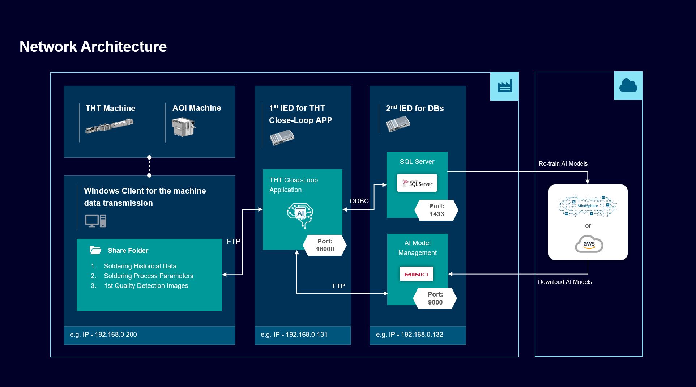

# Bring own applications to shopfloor - PCB quality re-check and production optimization based on AI techonology

Below you can find the structure of this use case.

- [Bring own applications to shopfloor - PCB production optimization and quality re-check based on AI techonology](#Bring-own-applications-to-shopfloor---PCB-production-optimization-and-quality-re-check-based-on-AI-techonology)
  - [Overview](#Overview)
    - [Project Background](#Project-Background)
    - [Reference Architecture](#Reference-Architecture)
    - [Network Architecture](#Network-Architecture)
  - [General task](#general-task)
  - [Requirements](#requirements)
    - [Used Components](#used-components)
    - [Prerequisites](#prerequisites)
  - [Configuration and Operation](#Configuration-and-Operation)
    - [Media Introduction](#Media-Introduction)
    - [Hands on Operation](#Hands-on-Operation )
  - [Documentation](#documentation)
  - [Contribution](#contribution)
  - [License and Legal Information](#license-and-legal-information)

## Overview 

#### Project Background

In the 3C industry, THT (Through Hole Technology) machine is responsible for the PCB soldering, and AOI (Automatic Optical Inspection) machine is responsible for the PCB quality inspection, both of these two machines are the key points in the PCB production. However, these two machines are facing some issues in the practical production environment.

- Quality re-check for AOI: the quality inspection standard of AOI is too strict, it is likely to cause PCB quality false inspection and product waste. Therefore, how to re-check the AOI quality inspection results efficiently and accurately is becoming particularly important.
- Process parameter optimization for THT: the soldering quality of PCBs can be optimized by adjusting THT process parameters, but how to gradually and stably optimize the THT process parameters is becoming a great challenge gradually.

In the traditional work process, a manual solution was added into the last workstation to resolve two issues above. However, the manual process usually has some weakness in the work stability, accuracy and efficiency, as well as difficult to quantify and continue effectively. 

In the current optimized work process, an AI solution is added into the last workstation to resolve two issues above. Compared with the manual solution, you can find AI solution has 3 advantages below.

1. **Accurately re-check product quality:** based on the PCB quality re-check AI model, the current solution can identify and classify product quality re-check results accurately, and product quality inspection experience can be continuously quantified and accumulated.
2. **Steadily improve product quality:** with the help of THT process parameter optimization AI model and AI self-learning technology, the current solution can periodically and stably optimize THT process parameters to further reduce product quality issues.
3. **Data traceability:** integrate the historical production data of THT and AOI effectively, providing basis for the data analysis and traceability.

#### Reference Architecture

The reference architecture of the AI solution consists of 2 parts.

- Factory Part

  | Step | Work Flow                                                    | From                                                         | To                                              |
  | ---- | ------------------------------------------------------------ | ------------------------------------------------------------ | ----------------------------------------------- |
  | 1.1  | Publish THT Close-Loop APP                                   | IEAP (Industrial Edge APP Publisher)                         | 1st Industrial Edge Device                      |
  | 1.2  | Publish SQL Server and MinIO                                 | IEAP                                                         | 2nd IED                                         |
  | 2.1  | Input Data - Soldering historical data - Soldering process data | THT machine                                                  | 1st Industrial Edge Device - THT Close-Loop APP |
  | 2.2  | Input Data - Quality detection images                   | AOI machine                                                  | 1st Industrial Edge Device - THT Close-Loop APP |
  | 3.1  | Output Data (PCB quality re-check) - Quality re-check results | 1st Industrial Edge Device - THT Close-Loop APP - PCB quality re-check AI mode | 2nd Industrial Edge Device - SQL Server         |
  | 3.2  | Output Data (process parameter optimization) - Soldering process data | 1st Industrial Edge Device - THT Close-Loop APP - THT process parameter optimization AI model | THT machine                                     |

- Cloud Part

  | Step | Work Flow               | From                                    | To                                 |
  | ---- | ----------------------- | --------------------------------------- | ---------------------------------- |
  | 4.1  | Retrain 2 AI models     | 2nd Industrial Edge Device - SQL Server | MindSphere/AWS Cloud               |
  | 4.2  | Synchronize 2 AI models | MindSphere/AWS Cloud                    | 2nd Industrial Edge Device - MinIO |

#### Network Architecture

Compared with the reference architecture, the network topology of the AI solution is shown as follows.

| Part    | Hardware                   | Address        | Function                                                     |
| ------- | -------------------------- | -------------- | ------------------------------------------------------------ |
| Factory | PC                         | 192.168.0.200  | Set up share folder for the input data                       |
| Factory | 1st Industrial Edge Device | 192.168.0.131  | Set up the THT Close-Loop APP for the AI model inferencing   |
| Factory | 2nd Industrial Edge Device | 192.168.0.132  | Set up the SQL Server and MinIO for the data and AI model storage |
| Cloud   | Server                     | Public network | Set up the environment for the AI model training             |

## General task

Gathering and importing the historical production data from THT machine and AOI machine by sharefolder, and using two AI models in the THT Close-Loop APP to make further quality analysis and close-loop optimization for the PCB products.

Using SQL Server to storage the THT Close-Loop APP inference results and key process data, using MinIO to manage and synchronize AI models centrally.

With the help of AI algorithm and model re-training, improving the PCB quality re-check accuracy and THT process parameter optimization stability.

## Requirements

#### Used Components

**Equipment**

- THT - SEHO
- AOI - SEHO

**Industrial Edge Platform**

- IEM (Industrial Edge Management)
  - Industrial Edge Management OS V1.2.0-36-amd64
  - Industrial Edge Management App V1.4.11
- Industrial Edge Device
  - IPC427E V1.5.0-21-amd64

**Edge App Development**

- Industrial Edge App Publisher (IEAP) V1.4.3

**3rd-party Apps**

- THT Close-Loop App V0.2.1

  > TensorFlow 2.5.0
  >
  > Docker image size - 2.99GB
  >
  > Limited memory - 1GB
  >
  > 1st AI model - PCB quality re-check model
  >
  > 2nd AI model - THT process parameter optimization model

- SQL Server

  > Microsoft SQL Server 2019 (RTM-CU15) (KB5008996) - 15.0.4198.2 (X64) - Developer Edition (64-bit) on Linux (Ubuntu 20.04.1 LTS) 

- MinIO

  > Architecture - amd64
  >
  > Version - 20220401034139.0.0

####  Prerequisites

**Equipment**

- Established connection to THT and AOI
- The PC sharefolder receiving the input data from the THT and AOI

**Industrial Edge Platform**

- Industrial Edge Learning Path (seen in the [Documentation](#Documentation))
- Access to an IEM
- Onboarded 2 Industrial Edge Devices on IEM

**Edge App Development**

- IEAP Learning Path (seen in the [Documentation](#Documentation))
- Using IEAP access to an IEM 

**3rd-Party Apps**

- Installed APPs, you can find the further information about the following app installation in the [docs](docs/)
  - Installed THT close-loop app on the 1st Industrial Edge Device by IEAP and IEM
  - Installed SQL Server on the 2nd Industrial Edge Device by IEAP and IEM
  - Installed MinIO on the 2nd Industrial Edge Device by IEAP and IEM
- Configured Tools
  - Using Google Chrome (Version ≥ 72) or Firefox (Version ≥ 62) to visit webpage
  - Access to MindSphere/AWS Cloud

## Configuration and Operation

You can configure and operate the apps in two ways shown as below.

#### Media Introduction

You can view the slide and video below, so that you can get the comprehensive understanding of the data flow and app features of this solution.

- Video link: [Introduction Video](./src/3rd-Application-Scenario-1st-Example-Introduction.html)

- Slide link: [Introduction Slides](./src/3rd-Application-Scenario-1st-Example-Introduction.pdf)

#### Hands on Operation

You can also visit and operate apps by using the Industrial Edge Device on cloud practically. Compared with the [media introduction](#4.1 media introduction) way, there will be some limitations due to the access security and intellectual property restrictions, but this method can let you have an intuitive understanding of the actual operation effect and interactive process of the apps.

- Visit rule

  Go to the issue tab of this repository and submit an Industrial Edge Device access application by clicking the "New issue" button, the issue tab is shown as below.

  

  Choose the "Industrial Edge Device_Access_Application" template to fill in the application form, then we will send back the Industrial Edge Device access account and password to you by email within 2-3 workdays. This account can guarantee you to visit the Industrial Edge Device websites for 5 days, once it expires, you need to re-apply the application, which is shown as below.

  **Tips: Please fill in the surveys when you apply for the account, we hope to get your feedback.**

   

- 1st Industrial Edge Device

  > link: [1st Industrial Edge Device access link](https://47.102.98.29)
  >
  > tips: containing the THT Close-Loop app, you can follow the [media introduction](#4.1 media introduction) to operate the features of the app.

- 2nd Industrial Edge Device

  > link: [2nd Industrial Edge Device access link](https://47.103.59.248)
  >
  > tips: containing the SQL Server and MinIO, both of these two databases have been configured successfully for the AI solution, you can operate it but please do not make any changes. 

## Documentation

You can find further documentation and help in the following links

  - [Industrial Edge Hub](https://iehub.eu1.edge.siemens.cloud/#/documentation)
  - [Industrial Edge Forum](https://www.siemens.com/industrial-edge-forum)
  - [Industrial Edge landing page](https://new.siemens.com/global/en/products/automation/topic-areas/industrial-edge/simatic-edge.html)
  - [Industrial Edge Learning Path](https://siemens-learning-simaticedge.sabacloud.com/)
  - Industrial Edge APP Publisher Learning Path
    - [Developer Guide Hands on App](https://github.com/industrial-edge/Developer-Guide-Hands-on-App.git)
    - [Industrial Edge APP Publisher CLI Getting Started](https://github.com/industrial-edge/upload-app-to-industrial-edge-management.git)

## Contribution

Thanks for your interest in contributing. Anybody is free to report bugs, unclear documentation, and other problems regarding this repository in the Issues section or, even better, is free to propose any changes to this repository using Merge Requests.

## License and Legal Information

Please read the [Legal information](./LICENSE.md).
