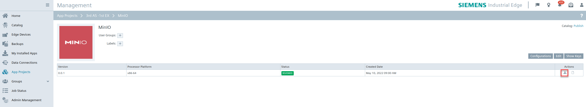

## Contents

- [Contents](#Contents)
- [Prerequisites](#Prerequisites)
- [Overview](#Overview)
- [Installation Steps](#Installation-Steps)
  1. [Connect to Industrial Edge Management by IEAP (Industrial Edge APP Publisher)](#1.-Connect-to-Industrial-Edge-Management-by-IEAP-(Industrial-Edge-APP-Publisher))
  2. [Create a new empty app in Industrial Edge Management](#2.-Create-a-new-empty-app-in-Industrial-Edge-Management)
  3. [Upload MinIO app to Industrial Edge Management](#3.-Upload-MinIO-app-to-Industrial-Edge-Management)
  4. [Install MinIO app on Industrial Edge Device](#4.-Install-MinIO-app-on-Industrial-Edge-Device)
- [Navigation](#navigation)

## Prerequisites

- Get familiar with the Industrial Edge App Developer Guide, which is available on [SIOS](https://support.industry.siemens.com/cs/ww/en/view/109795865). It contains description of the requirements as well as the step-by-step description how to install and work with the [Industrial Edge APP Developer Guide repository](https://github.com/industrial-edge/Developer-Guide-Hands-on-App).
- Install and onboard an Industrial Edge Management , install an IEAP (Industrial Edge APP Publisher).

## Overview

Main features of the MinIO in this application example:

- Download the AI models from the cloud and synchronize to the THT Close-Loop APP
- Collect the dataset from the THT Close-Loop APP and upload to the cloud for the AI models retraining

The following picture shows the technical routing of the THT Close-Loop APP deployment, the indexe in the picture are corresponded to the steps in the [Installation Steps](#Installation Steps).

## Installation Steps

#### 1. Connect to Industrial Edge Management by IEAP (Industrial Edge APP Publisher)

The installation description of this step is the same as the 1st step of the [THT Close-Loop APP Installation](./install_THT-Close-Loop-APP.md), for more details can see the related document.

#### 2. Create a new empty app in Industrial Edge Management

The installation description of this step is the same as the 2nd step of the [THT Close-Loop APP Installation](./install_THT-Close-Loop-APP.md), for more details can see the related document.

#### 3. Upload MinIO app to Industrial Edge Management

The installation description of this step is similar with the 3rd step of the [THT Close-Loop APP Installation](./install_THT-Close-Loop-APP.md), for more details can see the related document.

The only difference is that MinIO is an open source software, you can use the `docker pull` command to pull the specified MinIO image from the GitHub repository.

Then you can import the docker-compose.yml file of MinIO into IEAP to install MinIO app on Industrial Edge Management directly. The template yml of MinIO can be downloaded from [MinIO | Deploy MinIO on Docker Compose](https://docs.min.io/docs/deploy-minio-on-docker-compose.html). The only difference is that you need to define the memory limitation of the app in the yml file.

#### 4. Install MinIO app on Industrial Edge Device

So far, you have completed the app uploading to Industrial Edge Management, and you can see the app version list in Industrial Edge Management. Then you can click on the download icon of your version and a new window to install the app is opened. 

Select the Industrial Edge Device of the list, where the app should run on. Click on the "Install now" button to execute the deployment to the Industrial Edge Device immediately. This will take a while.

When the app installation is successfully done, you will see the icon shown as below.

## Navigation

- [Overview](../README.md)
