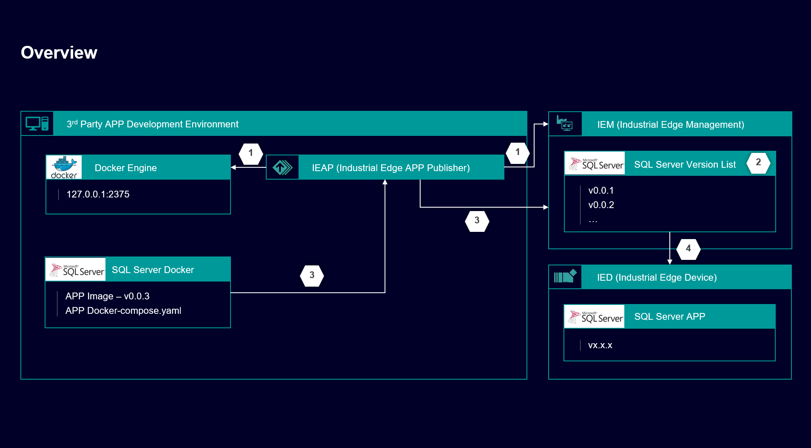
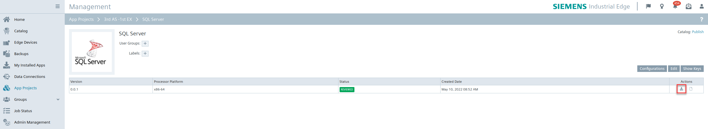
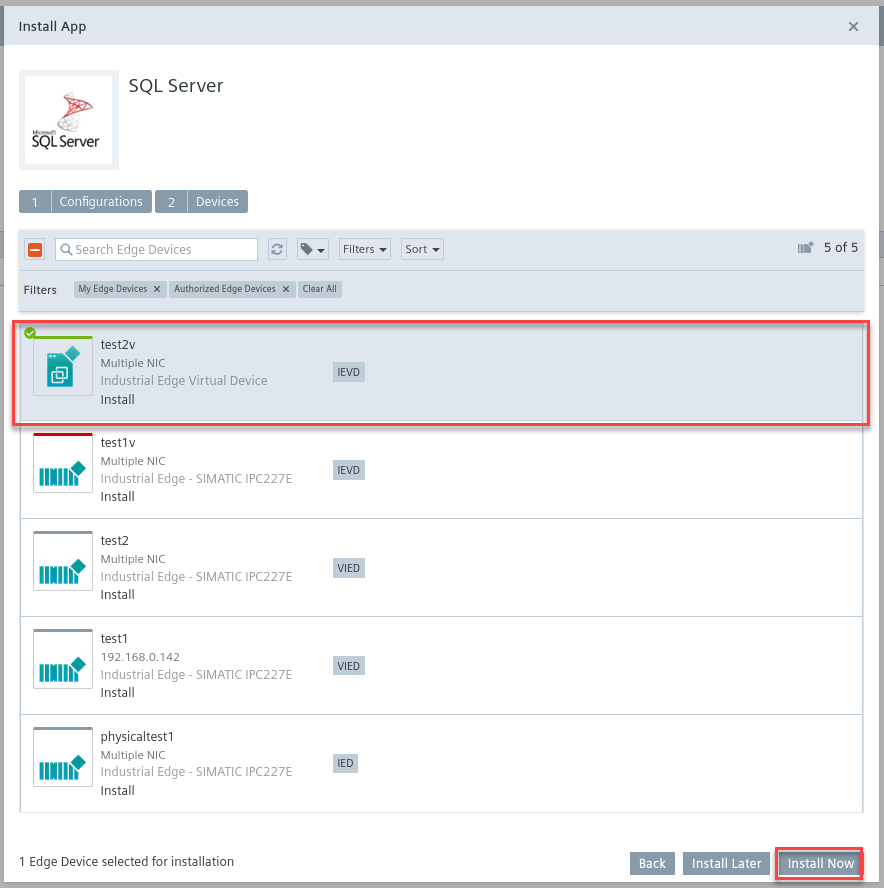
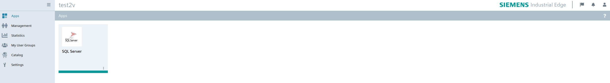

## Contents

- [Contents](#Contents)
- [Prerequisites](#Prerequisites)
- [Overview](#Overview)
- [Installation Steps](#Installation Steps)
  1. [Connect to IEM (Industrial Edge Management) by IEAP (Industrial Edge APP Publisher)](#1. Connect to IEM (Industrial Edge Management) by IEAP (Industrial Edge APP Publisher))
  2. [Create a new empty app in IEM](#2. Create a new empty app in IEM)
  3. [Upload SQL Server app to IEM](#3. Upload SQL Server app to IEM)
  4. [Install SQL Server app on IED](#4. Install SQL Server app on IED)
- [Navigation](#navigation)


## Prerequisites

- Get familiar with the Industrial Edge App Developer Guide, which is available on [SIOS](https://support.industry.siemens.com/cs/ww/en/view/109795865). It contains description of the requirements as well as the step-by-step description how to install and work with the [Industrial Edge APP Developer Guide repository](https://github.com/industrial-edge/Developer-Guide-Hands-on-App).
- Install and onboard an IEM (Industrial Edge Management), install an IEAP (Industrial Edge APP Publisher).


## Overview

The following picture shows the technical routing of the THT Close-Loop APP deployment, the number in the picture is corresponded to the steps in the [Installation Steps](#Installation Steps).




## Installation Steps

#### 1. Connect to IEM (Industrial Edge Management) by IEAP (Industrial Edge APP Publisher)

The installation description of this step is the same as the 1st step of the [THT Close-Loop APP Installation](./install_THT-Close-Loop-APP.md), for more details can see the related document.

#### 2. Create a new empty app in IEM

The installation description of this step is the same as the 2nd step of the [THT Close-Loop APP Installation](./install_THT-Close-Loop-APP.md), for more details can see the related document.

#### 3. Upload SQL Server app to IEM

The installation description of this step is similar with the 3rd step of the [THT Close-Loop APP Installation](./install_THT-Close-Loop-APP.md), for more details can see the related document.

The only difference is that SQL Server is an open source software, you can pull the image from the public repository, using the following code to download the specified SQL Server image.

```
docker pull mcr.microsoft.com/mssql/server:2017-latest
```

Then you can import the following docker-compose.yaml file into IEAP to install SQL Server app on IEM directly.

```
version: "2.4"
services: 
    sqlserver:
        image: mcr.microsoft.com/mssql/server:2017-latest
        container_name: sqlserver
        ports: 
            - 1433:1433
        restart: on-failure
        volumes: 
            - storage_app_sqlserver:/var/opt/mssql
            - storage_app_sqlserver_time:/etc/localtime:ro
        mem_limit: 2gb
        environment:
            - ACCEPT_EULA=Y
            - SA_PASSWORD=<password>          

volumes:
    storage_app_sqlserver:
    storage_app_sqlserver_time:
```

#### 4. Install SQL Server app on IED

So far, you have completed the app uploading to IEM, and you can see the app version list in IEM. Then you can click on the download icon of your version and a new window to install the app is opened. 

Select the IED of the list, where the app should run on. Click on the "Install now" button to execute the deployment to the IED immediately. This will take a while.



When the app deployment is successfully done, you will see the icon shown as below.


## Navigation

- [Overview](../README.md)
