## Contents

- [Contents](#Contents)
- [Prerequisites](#Prerequisites)
- [Overview](#Overview)
- [Installation Steps](#Installation-Steps)
  1. [Connect to Industrial Edge Management by IEAP (Industrial Edge APP Publisher)](#1.-Connect-to-Industrial-Edge-Management-by-IEAP-(Industrial-Edge-APP-Publisher))
  2. [Create a new empty app in Industrial Edge Management](#2.-Create-a-new-empty-app-in-Industrial-Edge-Management)
  3. [Upload THT Close-Loop app to Industrial Edge Management](#3.-Upload-THT-Close-Loop-app-to-Industrial-Edge-Management)
  4. [Install THT Close-Loop app on Industrial Edge Device](#4.-Install-THT-Close-Loop-app-on-Industrial-Edge-Device)
- [Navigation](#navigation)

## Prerequisites

- Get familiar with the Industrial Edge App Developer Guide, which is available on [SIOS](https://support.industry.siemens.com/cs/ww/en/view/109795865). It contains description of the requirements as well as the step-by-step description how to install and work with the [Industrial Edge APP Developer Guide repository](https://github.com/industrial-edge/Developer-Guide-Hands-on-App).
- Install and onboard an Industrial Edge Management (Industrial Edge Management), install an IEAP (Industrial Edge APP Publisher).

## Overview

The following picture shows the technical routing of the THT Close-Loop APP deployment, the indexes in the picture are corresponded to the steps in the [Installation Steps](#Installation Steps).

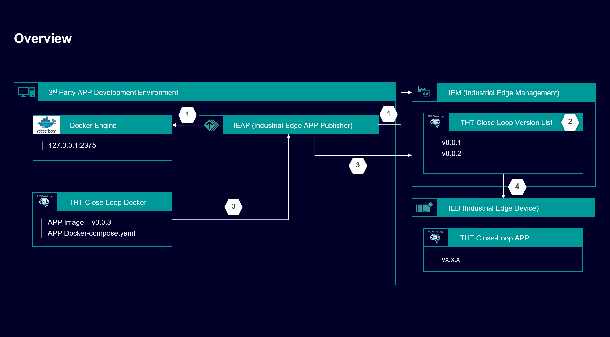

## Installation Steps

#### 1. Connect to Industrial Edge Management by IEAP (Industrial Edge APP Publisher)

Click on "+Docker Engine" button to add the local Docker Engine to the IEAP of your development environment. 

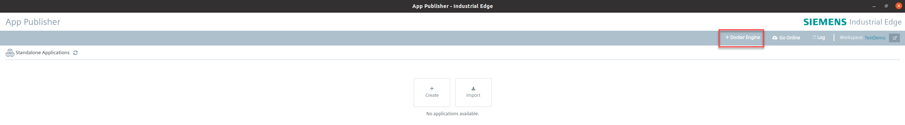

Configure the Docker Engine connection and Click on "Connect" button to connect the local Docker Engine.

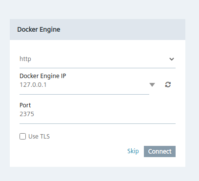

Click on “Go Online” to connect to the Industrial Edge Management system.

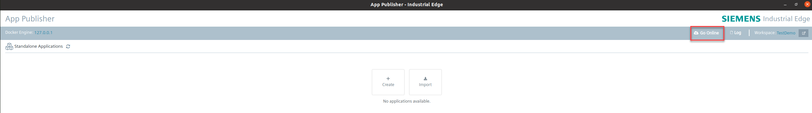

A new window will open to enter the Industrial Edge Management URL, aftering entering the Industrial Edge Management URL, click on the "Connect" button.

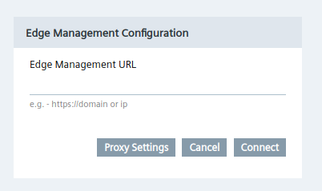

Then you need to provide your personal credentials to login Industrial Edge Management.

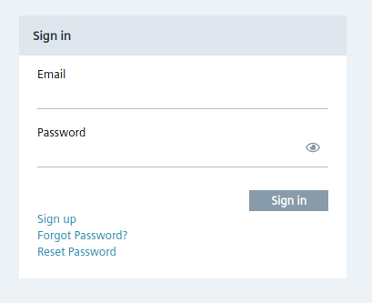

#### 2. Create a new empty app in Industrial Edge Management

After you connect to the Industrial Edge Management you should see the picture below, to view the apps loaded in the Industrial Edge Management. Then you can click on the "+Create Application" button to add a new empty app for the importing preparation of the THT Close-Loop app.

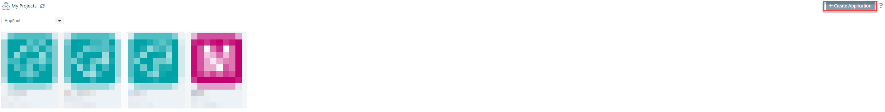

Then please fill out all fields in the picture below, the content is used to describe the THT Close-Loop app, then you can click on the "Create" button. 

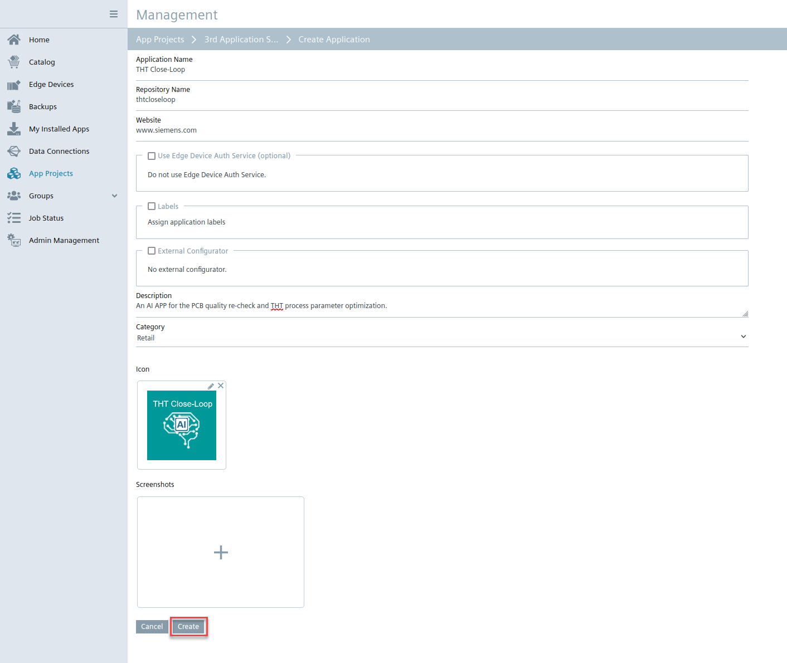

After you complete the THT Close-Loop app repository creation, you can see your currently created app repository with selected icon in the Industrial Edge Management. Then you can import your THT Close-Loop app instance into this repository.

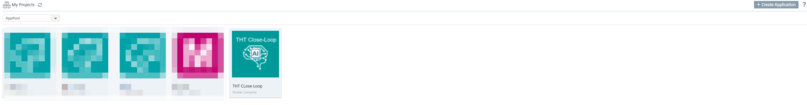

#### 3. Upload THT Close-Loop app to Industrial Edge Management

Click on the icon of your app, you will enter the app version management page. Then you click on "+Add New Version", a new dialog to select your docker compose version. 

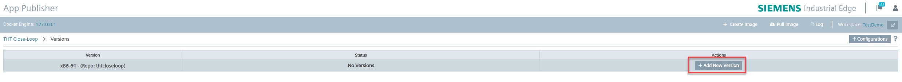

**Since the THT Close-Loop app is a third-party app with non-open source, we cannot fully open the app image, so we ignore the image installation step in the development environment and directly enter the docker-compose file configuration step.**

Now you have two options to create a docker-compose file of your app in IEAP: 

1. "+Add Services": graphical supported by dialogues to create a corresponding docker-compose.yml file 
2. "Import YAML": import of an existing docker-compose.yml file and adapt it afterwards

In this use case, you can select the 2nd option to import an existing docker-compose.yml file of the THT Close-Loop directly. **Since there are some credential information in the yml file, we cannot fully display it.**

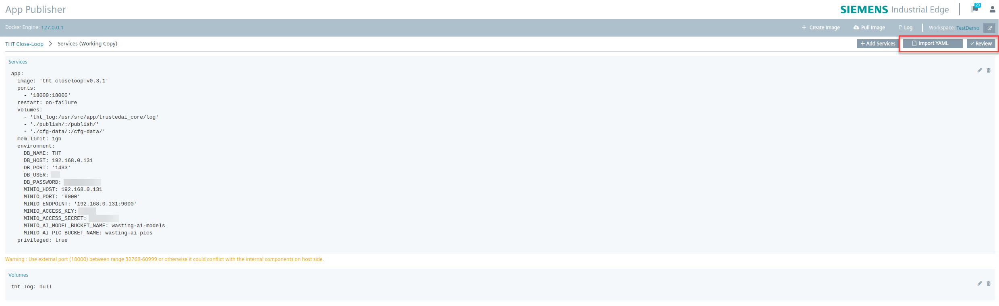

After all the docker-compse.yml configuration completed, a window with ‘Add version’ appears. As it is the first version of your app, you do not need to modify anything and just click on ‘Create’.

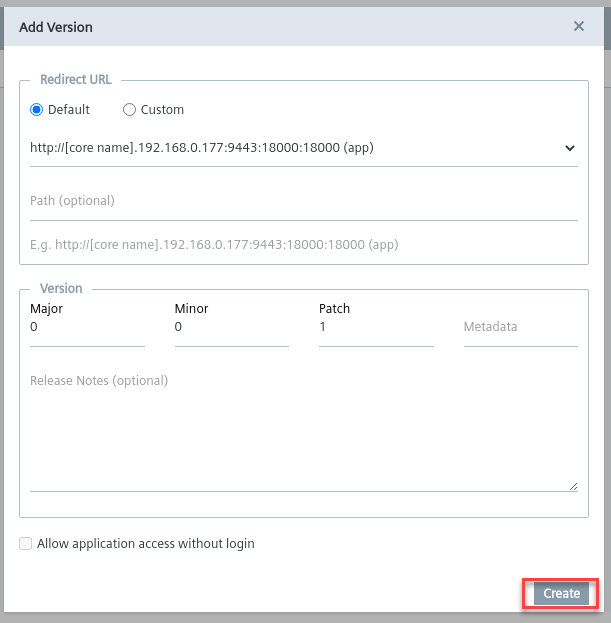

If everything in the docker-compose is correct and the built images are available, your first version of your THT Close-Loop app is available to be uploaded to Industrial Edge Management. This might take a second. 

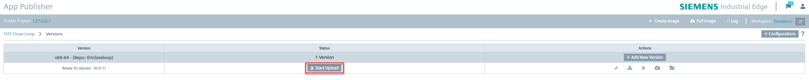

#### 4. Install THT Close-Loop app on Industrial Edge Device

So far, you have completed the app uploading to Industrial Edge Management, and you can see the app version list in Industrial Edge Management. Then you can click on the download icon of your version and a new window to install the app is opened. 

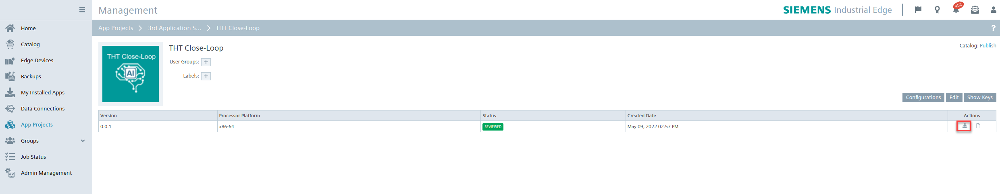

Select the Industrial Edge Device of the list, where the app should run on. Click on the "Install now" button to execute the deployment to the Industrial Edge Device immediately. This will take a while.

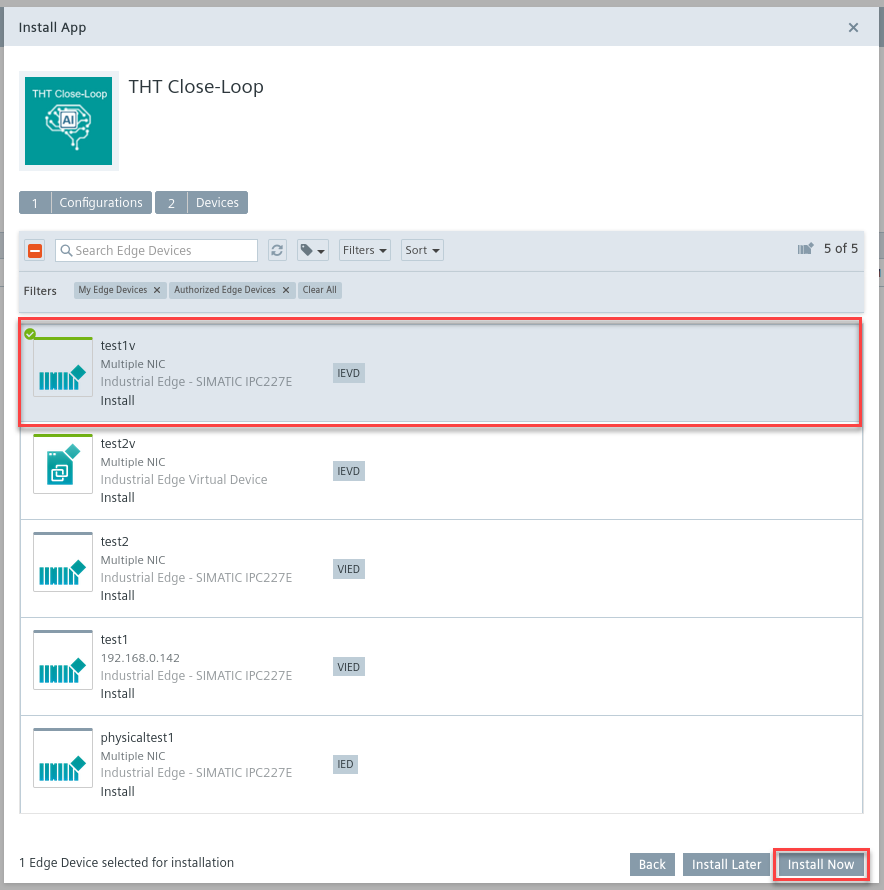

When the app installationis successfully done, you will see the icon shown as below.

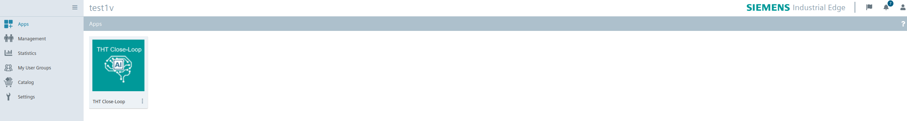

## Navigation

- [Overview](../README.md)
